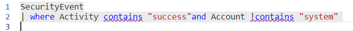
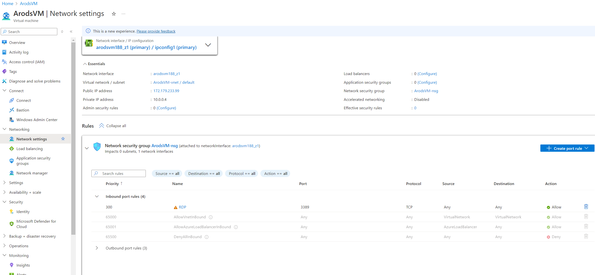
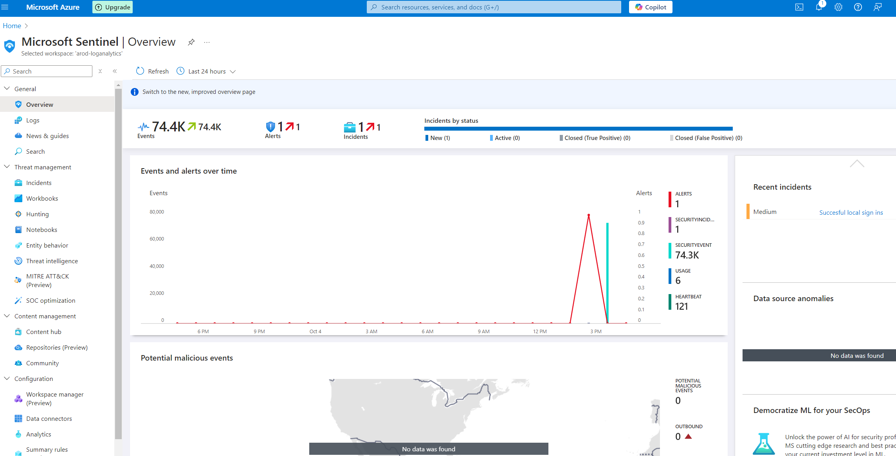
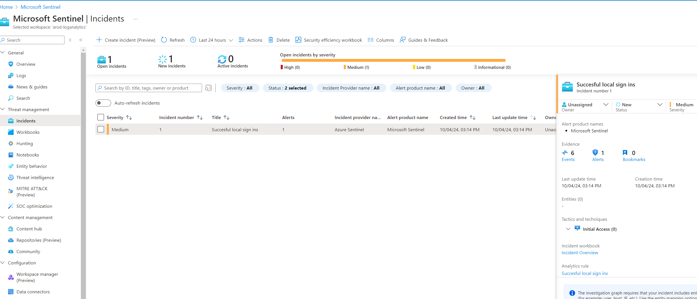
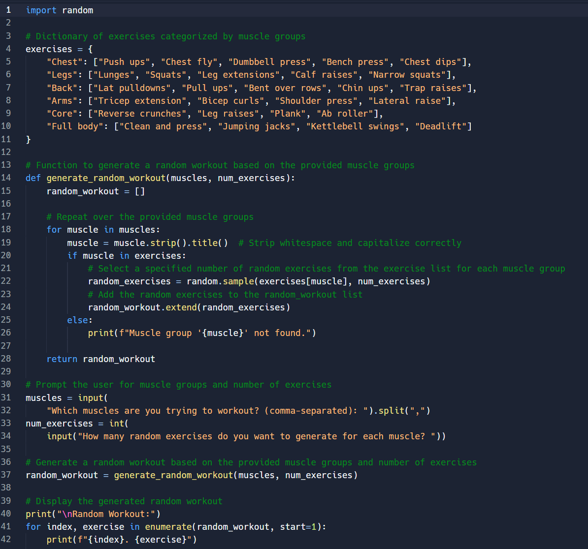
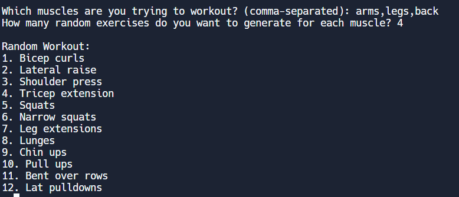

# <span style="font-size: 1.25em;">Adrian Rodriguez - Aspiring Cybersecurity Professional</span>

Welcome to my GitHub Page! I am passionate about Cybersecurity and Information Technology. Explore my projects, certifications, and resources below.

## <span style="font-size: 1em;"> About Me
I am currently pursuing my Bachelor's in Cybersecurity and Information Assurance at Western Governors University. In addition to my studies, I work as a Peer Coach, helping students prepare for and pass the CompTIA A+ exam. I'm passionate about growing and learning in the cybersecurity field and excited to continue building on my foundational skill set as I advance in this industry


## <span style="font-size: 1em;">Certifications

- **CompTIA A+** - January 2024
- **CompTIA Network+** - April 2024
- **CompTIA Security+** - July 2024
- **ITIL** - September 2024

---

## <span style="font-size: 1em;">Skills & Tools

| Skill           | Level        | 
|-----------------|--------------|
| Linux/Mac/Windows | Advanced     | 
| Microsoft 365 Suite/Teams | Advanced  |
| Cisco Webex       | Advanced      | 

---


## <span style="font-size: 2em;">Projects</span>


## <span style="font-size: 1.5em;">SIEM Project on Microsoft Azure</span>

I created a Security Information and Event Management (SIEM) system using Microsoft Azure. The project involved setting up a Virtual Machine (VM) with an open RDP port and using **Microsoft Sentinel** to monitor and detect successful RDP sign-ins. This setup allows for the continuous management of events to identify potential security risks related to Remote Desktop Protocol.

**Tools Used**:
- **Microsoft Azure** (for deploying the VM)
- **Microsoft Sentinel** (for event monitoring and detection)
- **Virtual Machine** (configured with an open RDP port)

**Key Features**:
- Monitors and logs successful RDP sign-ins.
- Custom detection rules in Microsoft Sentinel to manage events.
- Automated alerts for suspicious login attempts via RDP.

**How It Works**:
I used Microsoft Sentinel to track event logs and detect successful RDP sign-ins by creating a custom detection string. 

**Rule creation**:



**Open RDP Port**:



**Incident Detection for Successful Login**:



**Monitoring the Incident**:



## <span style="font-size: 1.5em;">Random Workout Generator</span>
A Python project that generates random workouts to help you mix up your exercise routine. I developed this as part of my final for my Introduction to Python course.

[View Project](https://github.com/A-r0d/random-workout-generator)

 Program Interface: 
 


 Sample Workout Output: 
 


---

```
The final element.
```
